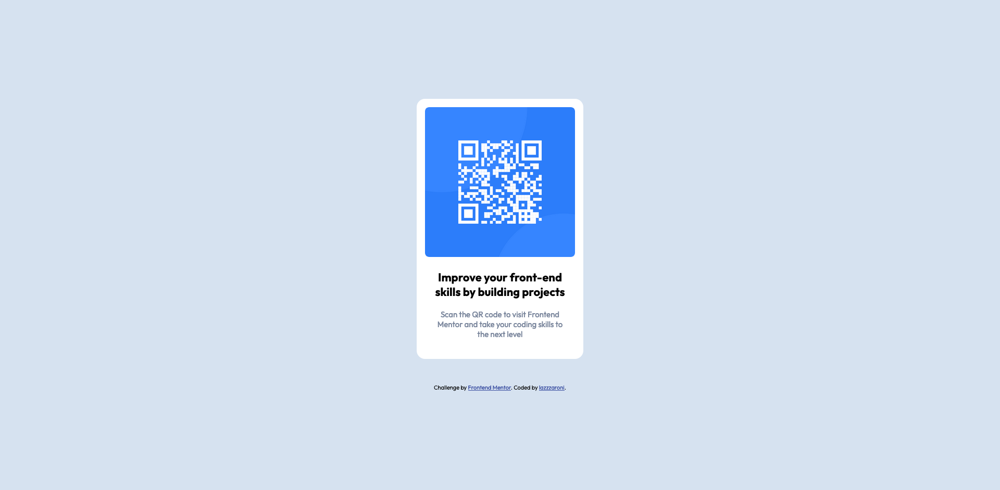

# Frontend Mentor - QR code component solution

This is a solution to the [QR code component challenge on Frontend Mentor](https://www.frontendmentor.io/challenges/qr-code-component-iux_sIO_H). Frontend Mentor challenges help you improve your coding skills by building realistic projects.

## Table of contents

- [Frontend Mentor - QR code component solution](#frontend-mentor---qr-code-component-solution)
  - [Table of contents](#table-of-contents)
  - [Overview](#overview)
    - [Screenshot](#screenshot)
    - [Links](#links)
  - [My process](#my-process)
    - [Built with](#built-with)
    - [What I learned](#what-i-learned)
    - [Continued development](#continued-development)
    - [Useful resources](#useful-resources)
  - [Author](#author)

**Note: Delete this note and update the table of contents based on what sections you keep.**

## Overview

### Screenshot



### Links

- Solution URL: [GitHub Repo](https://github.com/lazzzaroni/qr-code-component)
- Live Site URL: [GitHub Pages](https://lazzzaroni.github.io/qr-code-component/)

## My process

### Built with

- Semantic HTML5 markup
- CSS custom properties
- Flexbox
- Mobile-first workflow

### What I learned

Using semantic HTML tags, descriptive CSS classes naming.

```html
<section class="card">
  
  <h1 class="heading">...</h1>
  <p class="description">...</p>
</section>
```

### Continued development

Working on pure HTML/CSS.

### Useful resources

- [Setting width and height on `` tag](https://www.smashingmagazine.com/2020/03/setting-height-width-images-important-again/) - setting width and height attributes on your images can prevent layout shifts and improve the experience of your site visitors.

## Author

- Website - [mpaliakou.dev](https://mpaliakou.dev)
- Frontend Mentor - [@lazzzaroni](https://www.frontendmentor.io/profile/lazzzaroni)
